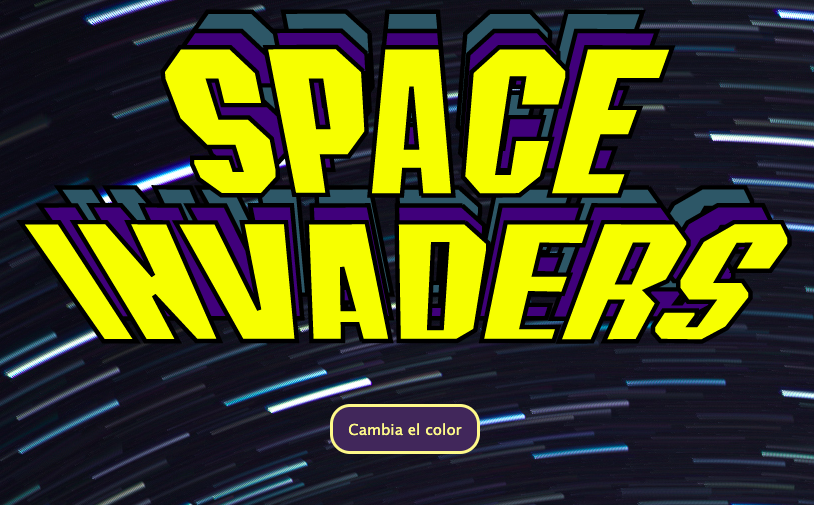

# Ejercicio Space Invaders 👾

Realizar un dibujo utilizando HTML y CSS. Crear y dar funcionalidad a un botón con Javascript que cambie el color del dibujo al presionarlo.

## Prerequisitos y herramientas 🛠

- Visual Studio Code
- Control de versiones con git
- Google Chrome

## Tecnologías 💻

- HTML
- CSS
- JavaScript

## Demo 📺

## Deploy ejercicio en Github pages 📱

https://crimanlor.github.io/theTeamRocket/

## Colaboradores 🙌🏼

- [Alejandra](https://github.com/alulaxp)
- [Lorena](https://github.com/crimanlor)

## Agradecimientos 🎁

Gracias a [Alejandra](https://github.com/alulaxp) por su apoyo y motivación durante las jornadas de estudio que realizamos juntas. She´s the best study partner 💛.
